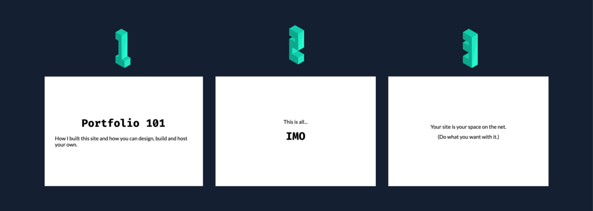
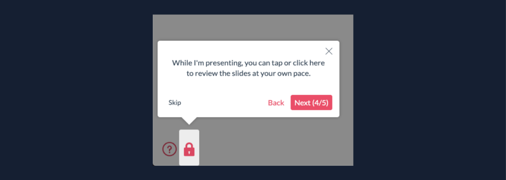
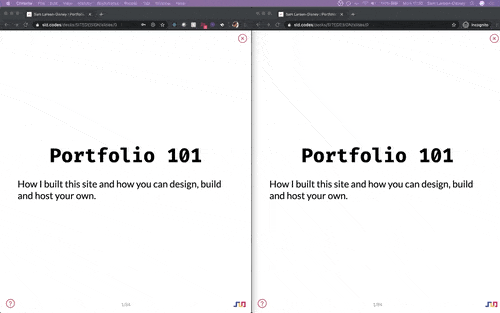
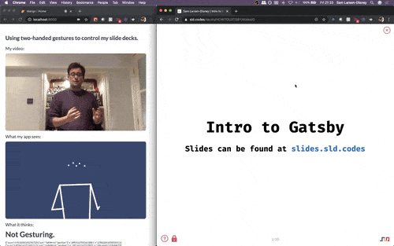
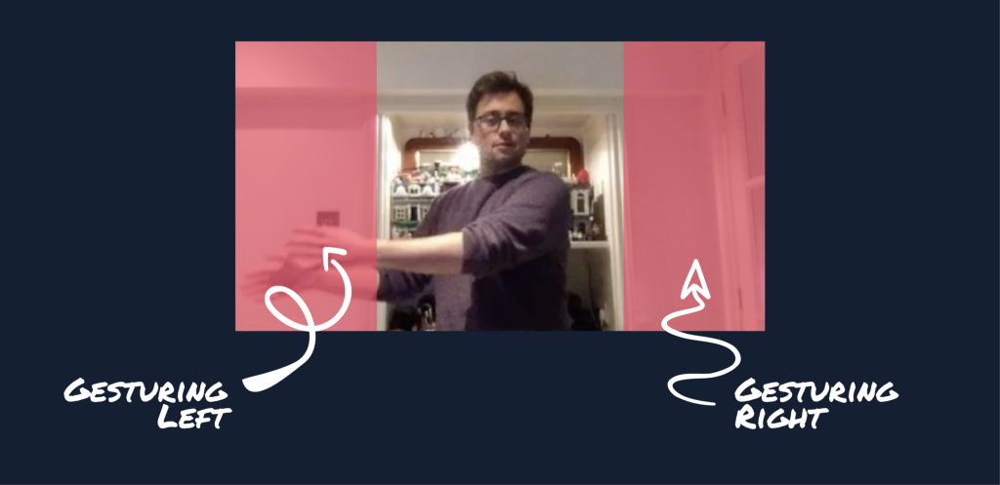

## The Problem

[I’ve been social distancing for a while now](https://sld.codes/articles/A-Social-Distancing-Infographic-Poster) and I’m working from home full time. I live in an old building with unreliable internet but, using a LAN cable, I get by most of the time. I disable my video and avoid sharing my screen wherever possible. However what happens when I need to present something to my team? Well, then my colleagues get a pixelated presentation and the occasional drop from their host.

The UX designer in me thinks this is less than ideal. I spend considerable time putting presentations together and they deserve a proper delivery. **I started to wonder if there was a better way to deliver slide decks — one that didn’t involve sharing my screen.**

## The Current Work Flow

PowerPoint and me are not friends. My slide decks are normally minimalist. They feature a title, an image, some code or an emoji per slide and that's about it. Almost always these elements are centered in the middle of the slide and when working in PowerPoint, I would find myself spending most of my time scaling images to fit the slide.

Whilst building out [my personal website](https://sld.codes/) last year in [Gatsby](https://www.gatsbyjs.org/), I came across [`gatsby-theme-mdx-deck`](https://www.npmjs.com/package/gatsby-theme-mdx-deck). As its name suggests, this theme takes MDX and turns it into slide decks — it was the PowerPoint alternative I was looking for.

### An Example Using `gatsby-theme-mdx-deck`

The first step is to add `gatsby-theme-mdx-deck` to your gatsby config:

```javascript:title=gatsby-config.js
{
  resolve: `gatsby-theme-mdx-deck`,
  options: {
    contentPath: `MDX/Decks`,
    basePath: `/decks`,
  },
}
```

The plugin expects a location where your MDX files are located and a basepath on where your decks should be found on your site.

In the folder I specified as the content path, I create a new `.mdx` file and add the following:

```mdx:title=MDX/Decks/SITEDESIGN/slides.mdx
---
title: "Portfolio 101"
desc: How I built this site and how you can design, build and host your own.
date: 2020-05-10
location: Space | Earth
---

# Portfolio 101

## How I built this site and how you can design, build and host your own.

This is all...

# IMO

---

Your site is your space on the net.
(Do what you want with it.)
```

You’ll see at the top of the file I have frontmatter that acts much like meta data, I query this data to show you information about the presentation you are about to open. The theme reads three dashes in a row as a signal to split the document and create a new slide. The above code outputs the following three slides when run:



That was easy! I can then navigate to `/decks` and surf through these slides using my arrow keys.

Another cool part to this is that your slides are hosted on a website. You can give anyone the URL and they can recap your slides at a later date. This method is how I built [version one of my presentations page](https://sld.codes/presentations).

### My Light Bulb Moment

_This was when I had a sudden idea: When I give a presentation, my slide decks are already hosted. Why don’t I just send people to the URL and let them “follow along” as I present?_

This takes the pressure off my bandwidth and instead pushes it off to each individual client. Yes, it means they have to download the slide assets, but this load is far smaller than streaming video — everyone wins. It also gives me the ability to add far more interactive elements to my slides to keep interest from viewers.

## Modifying `gatsby-theme-mdx-deck`

In order to start working on this library I moved it from my `node-modules` folder into a folder called `plugins`. Gatsby knows that this folder contains any local versions of plugins that I am working on.

### Improving The UX

The first thing I wanted to do was make the way in which you interact with the slide decks more obvious. When you navigate to a slide deck there are no instructions and no interact-able elements. I decided that I should add the following buttons:


Note that the toggle button will only be present when I am presenting a talk. When I am not, you get control of the slides!

In the situations when I am not around to give you the tour of how these buttons work, I thought I would let [`react-joyride`](https://www.npmjs.com/package/react-joyride) do it for me. I decided to use a cookie to determine whether the user had seen the tour before. I would only trigger the tour if that cookie had not been set:

```javascript:title=plugins/gatsby-theme-mdx-deck/src/components/tour.js
export default () => {
  const [cookies, setCookie] = useCookies()
  const TourActive = !cookies.SLDPresTourCookie
  const tourCB = e => {
    if (e.action === "reset" || e.action === "close") {
      setCookie("SLDPresTourCookie", true)
    }
  }
  return (
    <Joyride
      steps={toursteps}
      run={TourActive}
      showSkipButton={true}
      continuous={true}
      callback={tourCB}
      showProgress={true}
      disableCloseOnEsc={true}
      disableOverlayClose={true}
    />
  )
}
```

The result:



I tried to keep the instructions short and sharp. You can check it out by [checking out one of my presentations](https://sld.codes/decks/HOWTOGATSBY/slides/0).

### Creating The “Follow Me” Feature

In order to get this to work I was going to need two new features — an internal state to monitor the position in the slides for viewers and a way of sending realtime updates from my machine. A Redux + Socket.IO combination would do nicely.

Up to this point my personal website had been entirely static. I had had no need to introduce internal state on any other page so I consulted the [Gatsby docs](/docs/adding-redux-store/) on the subject. That combined with this [awesome repo](https://github.com/itaylor/redux-socket.io) on Redux and Socket.IO combined, gave me all the pieces I needed to create the feature — I just had to bring them together.

#### Creating The Server

I spun up a Node.js server on and added the following code:

```javascript:title=app.js
io.on("connection", function (socket) {
  if (active) {
    //If there is a presentation already started, tell the user.
    socket.emit("action", {
      type: "startLivePresentor",
      data: pres,
    })
  }
  socket.on("action", action => {
    if (action.type === "server/verify") {
      // When I want to initiate a presentation, I send this action and verify it is myself with the password.
      if (process.env.PRESENT_PASSWORD === action.data.password) {
        pres.presenter = socket.id
        active = true
        pres.deck = action.data.location
        pres.slide = action.data.index
        //I tell any connected clients that I have started the presentation.
        io.emit("action", {
          type: "startLivePresentor",
          data: pres,
        })
      }
    }
    if (action.type === "server/updateIndex") {
      if (socket.id === pres.presenter) {
        // When I (the presenter), update the other clients so they can also update their slides
        pres.slide = action.data
        io.emit("action", {
          type: "updatePresIndex",
          data: pres,
        })
      }
    }
    if (action.type === "server/endPres") {
      if (socket.id === pres.presenter) {
        // When I (the presenter) end the presentation, notify viewers
        io.emit("action", {
          type: "endLivePresentor",
        })
        active = false
        pres = defaultPres
      }
    }
  })
  socket.on("disconnect", function () {
    if (socket.id === pres.presenter) {
      // When I (the presenter) get disconnected, end the presentation and notify viewers
      io.emit("action", {
        type: "endLivePresentor",
      })
      active = false
      pres = defaultPres
    }
  })
})
```

## Implementing Redux On The Site

First we need to add a custom wrapper around Gatsby:

```javascript:title=gatsby-browser.js
import wrapWithProvider from "./src/state/wrapWithProvider"
export const wrapRootElement = wrapWithProvider
```

This wrapper needs to wrap our site content in a Redux provider.

```jsx:title=src/state/wrapWithProvider.js
import React from "react"
import { Provider } from "react-redux"
import createStore from "./createStore"
export default ({ element }) => {
  return <Provider store={createStore}>{element}</Provider>
}
```

In our store we add methods to handle any incoming actions from the server. Notice the `socketIoMiddleware` that catches any actions that start with `/server` and emits them to our server.

```javascript:title=src/state/createStore.js
import { createStore, applyMiddleware } from "redux"
import createSocketIoMiddleware from "redux-socket.io"
import io from "socket.io-client"
let socket = io("http://your-socket-server-here.com")
let socketIoMiddleware = createSocketIoMiddleware(socket, "server/")
function reducer(
  state = {
    livePresenter: false,
    follow: true,
    verified: false,
  },
  action
) {
  switch (action.type) {
    case "follow":
      return Object.assign({}, { ...state, follow: action.data })
    case "verify":
      return Object.assign({}, { ...state, verified: action.data })
    case "updatePresIndex": {
      return Object.assign({}, { ...state, presentation: action.data })
    }
    case "startLivePresentor":
      return Object.assign(
        {},
        { ...state, livePresenter: true, presentation: action.data }
      )
    case "endLivePresentor":
      return Object.assign(
        {},
        {
          ...state,
          livePresenter: false,
          presentation: undefined,
          verified: false,
        }
      )
    default:
      return state
  }
}
let store = applyMiddleware(socketIoMiddleware)(createStore)(reducer)
store.subscribe(() => {
  console.log("new client state", store.getState())
})
export default store
```

Now if we connect any component using Redux we will have access to these values.

```javascript:title=plugins/gatsby-theme-mdx-deck/src/components/deck.js
const Deck = ({
  follow,
  presentation,
  livePresenter,
  changePresPosOnServer,
  verified,
}) => {
  /* ... */
  /*
  If their is a live presenter and:
  A. You ARE NOT the one presenting
  B, You are in the same deck as the one being presented
  C. You have follow turned on.
  Then: Jump to the slide that the live presenter is on
  */
  if (
    !verified &&
    livePresenter &&
    follow &&
    presentation &&
    window.location.pathname.includes(presentation.deck) &&
    window.location.pathname !==
      presentation.deck + "/slides/" + presentation.slide
  ) {
    jump(slug, presentation.slide)
  }
  /*
  If their is a live presenter and:
  A. You ARE the one presenting
  B. The slide you are on does not match the index on the server
  Then: Emit action the server telling the viewers where you are
  */
  if (
    verified &&
    presentation &&
    window.location.pathname !== "/presentations/" &&
    index !== presentation.slide
  ) {
    changePresPosOnServer(index)
  }
  return <>{/* Slides rendered here */}</>
}
const mapStateToProps = ({ presentation, follow, livePresenter, verified }) => {
  return { presentation, follow, livePresenter, verified }
}
const mapDispatchToProps = dispatch => {
  return {
    changePresPosOnServer: value =>
      dispatch({ type: "server/updateIndex", data: value }),
  }
}
const ConnectedDeck =
  typeof window !== `undefined`
    ? connect(mapStateToProps, mapDispatchToProps)(Deck)
    : Deck
export default ConnectedDeck
```

And just like that we can now control slide decks remotely!



## Get The Code:

[Personal Site Repo](https://github.com/slarsendisney/personal-site)

[Socket Server](https://github.com/slarsendisney/sld-clicker)

## Extension: Gesture Controlling My Slides

<<<<<<< HEAD
[I recently attended a conference called “Halfstack”](https://sld.codes/articles/My-learnings-from-HalfStack's-Conference). While I was there I saw a demo of [PoseNet](https://www.npmjs.com/package/@tensorflow-models/posenet). An awesome library that uses a model to identify key body parts from an image or video. I thought it would be cool to use this library to create touch-free slide navigation for presenters using just their gestures.
=======
[I recently attended a conference called “HalfStack”](https://sld.codes/articles/My-learnings-from-HalfStacks-Conference). While I was there I saw a demo of [PoseNet](https://www.npmjs.com/package/@tensorflow-models/posenet). An awesome library that uses a model to identify key body parts from an image or video. I thought it would be cool to use this library to create touch-free slide navigation for presenters using just their gestures.

> > > > > > > master

### How PoseNet Works

PoseNet uses a trained model to take an image and make an attempt at guessing the location of key body parts in that photo. You can see how, in the preview below, the skeleton is very closely matching my actual position — I was super impressed with its accuracy.



Being a magician! 🎩

It can be implemented relatively easily (code borrowed from [Kirsten Lindsmith's "PoseNet for React" repo on GitHub](https://github.com/kirstenlindsmith/PoseNet_React/blob/master/client/components/Camera.js)):

```jsx
class PoseNet extends Component {
  async componentDidMount() {
    try {
      this.posenet = await posenet.load()
    } catch (error) {
      throw new Error("PoseNet failed to load")
    } finally {
      setTimeout(() => {
        this.setState({ loading: false })
        this.props.loadComplete()
      }, 200)
    }
    this.detectPose()
  }
  detectPose() {
    const { videoWidth, videoHeight } = this.props
    const canvas = this.canvas
    const canvasContext = canvas.getContext("2d")
    canvas.width = videoWidth
    canvas.height = videoHeight
    this.poseDetectionFrame(canvasContext)
  }
  poseDetectionFrame(canvasContext) {
    const posenetModel = this.posenet
    const video = this.video
    const findPoseDetectionFrame = async () => {
      let poses = []
      const pose = await posenetModel.estimateSinglePose(video, {
        imageScaleFactor,
        flipHorizontal,
        outputStride,
      })
      poses.push(pose)
      canvasContext.clearRect(0, 0, videoWidth, videoHeight)
      poses.forEach(({ score, keypoints }) => {
        if (score >= minPoseConfidence) {
          this.props.poseCB({ keypoints })
          if (showSkeleton) {
            drawSkeleton(
              keypoints,
              minPartConfidence,
              skeletonColor,
              skeletonLineWidth,
              canvasContext
            )
          }
        }
      })
      requestAnimationFrame(findPoseDetectionFrame)
    }
    findPoseDetectionFrame()
  }
  render() {
    return (
      <div>
        <video
          id="videoNoShow"
          className="border-radius"
          style={{ display: "none" }}
          playsInline
          ref={this.getVideo}
        />
        <canvas
          className="webcam is-blue-bg border-radius"
          ref={this.getCanvas}
          style={{ width: "100%", height: "100%", margin: "auto" }}
        />
      </div>
    )
  }
}
export default PoseNet
```

### Using This Data

Now what this gives us access to is an array of keypoints. Each point represents a body part, PoseNet’s estimate of where that body part is and its confidence score.

For my purposes, I focused on the wrists. When gesturing right or left, both wrists are close together and in a specific portion of the screen.



When both wrists were in the same box, I knew I was gesturing for a slide change.

All that was left was to work out whether my poses array containing the positions of the left and right wrist had placed them both in the bounding box. I could then use my socket connection as above to change the slide.

```javascript
useEffect(() => {
  if (presentation && differenceInSeconds(new Date(), lastPunch) > 0.5) {
    const gesturingRight = poses.every(
      item => item.position.x > window.innerWidth * 0.75
    )
    const gesturingLeft = poses.every(
      item => item.position.x < window.innerWidth * 0.25
    )
    if (gesturingRight && presentation.slide >= 0) {
      changePresPosOnServer(presentation.slide + 1)
    }
    if (gesturingLeft && presentation.slide > 0) {
      changePresPosOnServer(presentation.slide - 1)
    }
    setLastPunch(new Date())
  }
}, [poses])
```

## That's all Folks!

I hope you have enjoyed this little experiment. If you have questions or want to join me on some of my other adventures you can find me at [sld.codes](https://sld.codes/).
